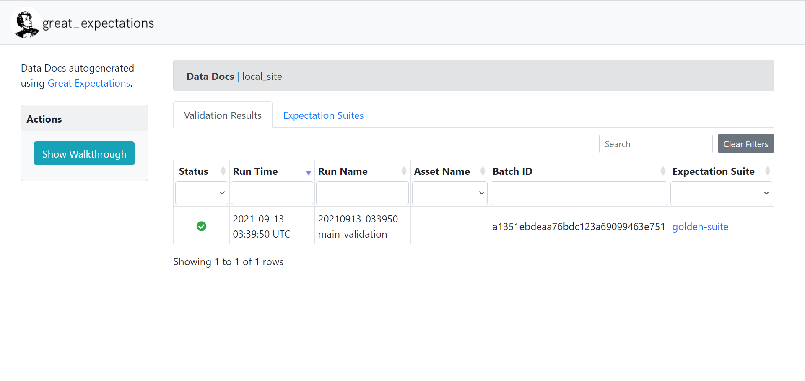
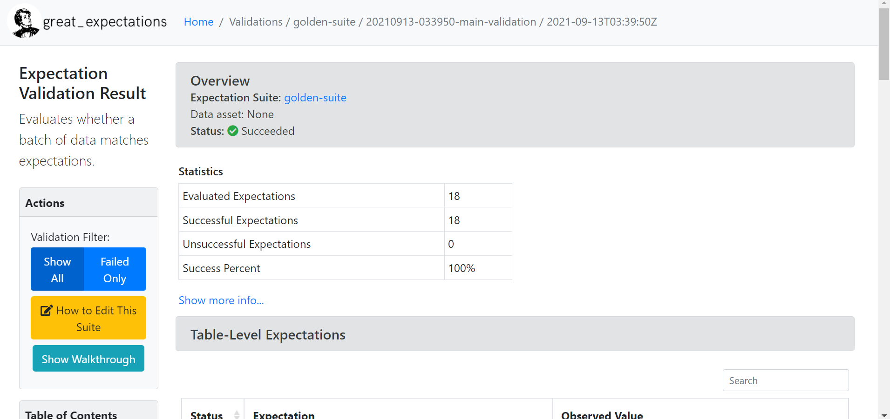

# Overview
<p>
As the dataset for PeTaL's labeler grows, so does the effort needed to maintain and update it. This repository contains a data pipeline used to circumvent this issue.
</p>

## Pipeline Summary
<p>
The pipeline is implemented through the Data Version Control (DVC) tool's workflow features. Each of these directories represent one or more of the stages within our workflow.
</p>

## Stages

### Visualization
```
    +-----------------+
    |  pullAskNature  |
    +-----------------+
             *
             *
             *
        +---------+
        | getDOIs |
        +---------+
             *
             *
             *
+--------------------------+
| convertAskNatureTaxonomy |
+--------------------------+
             *
             *
             *
        +---------+
        | combine |
        +---------+
             *
             *
             *
        +---------+
        | convert |
        +---------+
             *
             *
             *
        +--------+
        | update |
        +--------+

+----------+
| validate |
+----------+
```

### Directory Stage Associations
```
AskNature
├─ pullAskNature
│  └─ algolia-downloader.py -> pullAskNature
├─ doi_scraper
│  └─ get_dois.py -> getDOIs
└─ taxonomy
   └─ taxonomy_converter.py -> convertAskNatureTaxonomy

LabeledData
├─ combine_csvs.py -> combine
└─ convert_with_mag.py -> convert

Update
└─ update_golden.py -> update

FinalFile
└─ ge_validate.py -> validate

```
## Stage Descriptions
- pullAskNature
     - This stage of the pipeline makes a call to the AskNature website's database hosted on Algolia. Algolia's api allows us to grab every paper updated or published within time frame. From here we extract the labels associated with the paper, its source URL and the doi.

- getDOIs
    - In this stage, we go through all of the source URLs we have pulled and we scrape a DOI for them if we do not already have it.

- convertAskNatureTaxonomy
    - The labels that AskNature assigns to its papers have a similar structure to PeTaL's. Because of this we can map their labels to the counter-part in our taxonomy. This stage takes a CSV which contains this function mapping information and programmatically converts their labels to ours.
    
    - If it fails to map their label to ours, it pulls the paper out into a separate CSV (currently *papers_to_label.csv*) which can then be manually reviewed.

- combine
    - This stage serves as the consolidation point. All sources of data, such as AskNature, will end up here. 

    - Once triggered, this stage will simply combine all of the CSVs of labeled papers within the 'LabeledData' directory, remove them and produce a new csv containing the merged data.

- convert
    - When this stage is run, it will pass all of the papers from the previously mentioned merged dataset through the MAG API. This will fill in any of the missing fields where possible.

    - Once this is complete, the stage finaly converts this data into a JSON file following the schema utilized within the golden.json file. 

- update
    - The data from the previous stage is merged into a copy of the golden.json file based on the petalID. Records with existing petalIDs are used to update files and records with no petalID are added in as new rows.

- validation
    - This stage is not dependent on the previous as indicated by the DAG above. When activated, it will pass the golden.json file within the FinalFile directory through a set of validation checks defined and enforced through the Great Expectation tool.

    - When complete, whether the validation was a success or a failure, a zipped file containing the report will be added to the Reports folder.

## How to Run
This pipeline would ideally be run automatically through a service like GitHub Actions and would not need to be manually triggered. However, some cases may call for this, such as testing new stages on your local environment.

### Install Requirements

Before you attempt to run this locally, you will first need to make sure you have the requirements through:
<br/>``pip install -r requirements.txt``

You will also need to ensure you have the correct NLTK packages, which you can do by running:
<br/> ``python -m nltk.downloader stopwords``
<br/> ``python -m nltk.downloader punkt``

Once this is satisfied, you will be able to follow one of the following methods to trigger the pipeline in different ways:

- Force Run:
    - ``dvc repro -f *STAGE_NAME*``
        - This command will force the pipeline to run the given stage even if none of the stage dependencies have changed.
        - \**STAGE_NAME*\* can be excluded to force run every stage.

- Run Pipeline from a Specific Stage
    - ``dvc repro --downstream *STAGE_NAME*``
        - This command will run the pipeline normally starting from stage \**STAGE_NAME*\*.

- Force Run Pipeline from a Specific Stage
    - ``dvc repro --force-downstream *STAGE_NAME*``
        - This command will force all stages to run starting at \**STAGE_NAME*\* even if none of the relevant stage dependencies have changed.

We can also view the current pipeline structure through ``dvc dag`` which will produce the results seen within the visualization section earlier.

If you need more information, you can refer to DVC's documents here: https://dvc.org/doc/start

### Current Workflows
There are currently three GitHub Actions workflows which exist to allow flexibility with running the pipeline:
- Pipeline
    - This workflow is the main one which will run periodically. It will run the full pipeline. There should be no real reason to run this workflow manually unless the scheduled run had failed.

- Revalidate
    - This workflow will only run the validation part of the pipeline and produce an equivalent report. It is to be run manually if a user updates the golden.json file within FinalFile manually after correcting faults elucidated by Great Expectations.

- MergeOnly
    - This workflow will not make queries to the data sources but will instead run the pipeline from the *combine* stage. This is to be used when data has been manually placed within the LabeledData folder and needs to be merged in sooner than scheduled run permits.

## Reading Validation Reports

This pipeline utilizes Great Expectations to validate new data changes. The output of the validation stage is a zip file within the ./FinalFile/Reports directory. This zipped report will have a time stamp within its name following the format *report_month-day-year-hour_minute_second*. You can either pull this along with other changes to your local repo or you can directly download the file within the GitHub website.

Upon extracting the file, navigating to *report_name*\great_expectations\uncommitted\data_docs\local_site will show a directory with an index.html file within it. Opening the HTML file within a browser will take you to the Great Expectations validation run browser with a summary of validation of this run being shown.

<br/>

 Pressing this summary will take you to the full report.

<br/>

## Handling Validation Failures

This pipeline validates data through the use of Great Expectations. As a result, data not conforming to the defined expectations will fail and this new data will not be eligble for merging into the main repository. If this occurs then either you will need to correct the errors as defined in the validation report, or you will need to revert the changes made by replacing the golden.json file with the golden_backup.json file in the same directory.


### Correcting Faulty Data
Great Expectations does not raise any exceptions when a datasource fails a validation test, thus there is no automatic roll-back when this happens. Instead, it always copies the original data into a file called golden_backup.json. You will either need to correct the data from the source file, manually revert the backup file and re-run part of the pipeline using the "merge_only" workflow, or you will need to manually correct the data within the golden.json file and re-run the validation part of the pipeline by triggering the "revalidate" workflow. As this is in a Git repo, you will need to pull the changes locally in order to make your fixes.

If you have manually corrected the data and would like to re-run the validation locally, then you can use ``great_expectations --v3-api checkpoint run main-val`` to do so. The report will be located in great_expecations\uncommitted\data_docs\local_site; this report will *not* be comitted, meaning even if you do this, you will still need to rerun the revalidate workflow when these changes are pushed to this repo.

## Merging Data into the PeTaL Labeller 

This pipeline does not currently generate a PR request automatically, this could be a point of interest to pursue in the future. For now, you will need to make a new branch from the PeTaL Labeler repository and replace the existing golden.json file with your modified one. When you make the PR to merge your branch into main, you will need to attach the validation report within the description so reviewers can download and review it. This should be straight-forward to review and is more of a confirmation rather than a proper review as the validation file should always be a 100% success.


## Future Works
A few features that will either need to be added in, or should be added in are:
- MTurk Integration
    - The pipeline should also have MTurk as one of its datasources.
- JSON DIFF
    - A stage called JSONDIFF should be added in. This stage would simply produce a JSON diff file between the new json file created within the Update stage and the golden JSON file prior to having these changes merged in.
    - When this stage is added, the JSON DIF file should be attached with the validation report when submitting a PR.
    - A few resources mentioned have been:
        - https://github.com/josephburnett/jd
        - https://jschon.readthedocs.io/en/latest/usage/catalog.html
        - https://github.com/jlevy/pdiffjson

- Automatic PR
    - Upon a successful *Pipeline* workflow completion, a PR should be automatically created for the PeTaL Labeler repository.
    - This would mean the only human intervention needed would either to approve a PR, or to fix faulty data in the case of a failed validation.